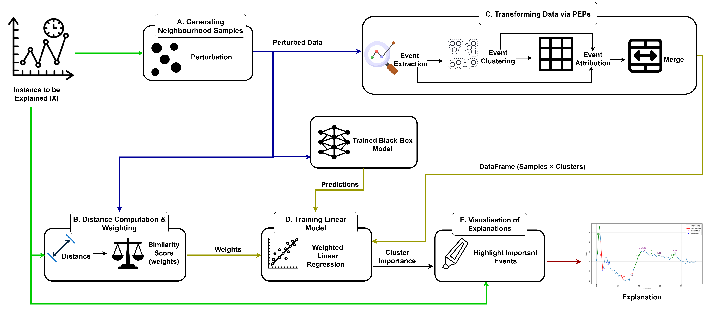
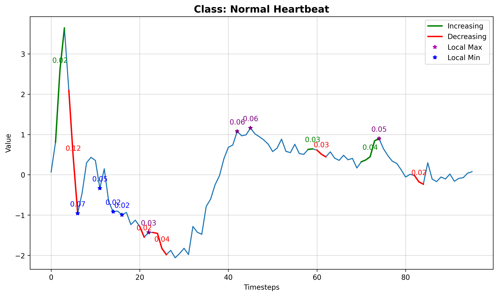

# LOMATCE: LOcal Model-Agnostic Time-series Classification Explanations

We propose LOcal Model-Agnostic Time-series Classification Explanations (LOMATCE, pronounced "lom-te-see"), a method akin to LIME [1], to explain deep-learning-based time series classifiers. LOMATCE uses parametrised event primitives (PEPs) to extract and parameterise events like increasing trends, decreasing trends, local maxima, and local minima from time series data. These PEPs capture temporal patterns, and facilitating the training of simple, interpretable models like linear regression [2]. Discussing time series in terms of these familiar events makes the explanations more intuitive and comprehensible.

## File description

- **lomatce**: This directory contains code files.

  - **examples**: Includes notebook examples for each dataset.

    <!-- - output.log:This file contains the fidelity scores for each dataset and perturbation strategy. -->

    <!-- * Example: Evaluation result for FCN model architecture trained on the ECG dataset and zero perturbation strategy can be found at `examples\results\simulation\ecg200\fcn-zero--2024-04-22_22-04-47\output.log.` -->

  - **utils**: Contains utility files:

    - `helper_class.py`: Functions for clustering, explanation plots, etc.
    - `test_dataloader.py`: Dataloader for the test set.

  - `explainer.py`: Core method implementation, from PEP extraction to applying interpretable models like linear regression to mimic deep learning inference.
  - `perturbation.py`: Applies various perturbation strategies and generates neighboring samples.
  - `lomatce_simulation.py`: Runs the FCN model multiple times with random train-test splits to ensure robustness of results.
  - `lomatce_vs_baseline.py`: Code to compare LOMATCE against LIME, SHAP, Integrated Gradients (IG), and a random baseline.

## Method Design

<!--  -->



**Fig 1:** The proposed XAI method for deep learning based time series classifiers using Parameterised Event Primitives (PEPs).

## How to Use LOMATCE

### 1. Install LOMATCE

```bash
git clone https://github.com/yourusername/lomatce.git
cd lomatce
pip install -r requirements.txt
```

### 2. Explain Predictions with LOMATCE

#### Import LOMATCE:

```python
from lomatce.explainer import LomatceExplainer
```

#### Instantiate the Explainer:

```python

lomatce_explainer = LomatceExplainer(basic_dir='path/to/data_directory')
```

#### Explain an Instance:

```python
explanation = lomatce_explainer.explain_instance(
    origi_instance=your_ts_instance,
    classifier_fn=your_model_predict_function,
    num_perturbations=1000,  # Number of perturbations
    n_clusters=20,           # Number of event clusters
    top_n=15,                # Top features to show
    class_names=["Class1", "Class2"]
)
```

#### Visualise the Explanation:

```python
explanation.visualise(your_ts_instance, show_probas=True)
```

### 3. Get Explanation Summary

```Python
summary = explanation.get_explanation_summary()
print(summary)
```

You will get key info like local model prediction, original (black-box model) prediciton and local fidelity score.

#### Sample Explanation Output

<!-- ##### Table **1**: Explanation faithfulness, with 95% confidence interval, across various perturbation methods.

|   Dataset    |      Zero       |      Mean       |   Total_mean    |     Random      |
| :----------: | :-------------: | :-------------: | :-------------: | :-------------: |
|   **ECG**    | $0.82 \pm 0.02$ | $0.70 \pm 0.02$ | $0.81 \pm 0.01$ | $0.54 \pm 0.10$ |
| **GunPoint** | $0.72 \pm 0.02$ | $0.52 \pm 0.03$ | $0.75 \pm 0.08$ | $0.75 \pm 0.08$ | -->

Here's an example of LOMATCE highlighting important regions of a time series:


**Fig 2:** Explanation highlights segment significance, relevance scores, and event types (e.g., increasing, decreasing, maxima, minima).

You can explore the example noteboks for each dataset in the [`examples/`] folder.

### 4. To Reproduce the Experiment

##### To evaluate the model perfromance and local fidelity over multiple random train-val-test splits:

```python

python lomatce_simulation.py --model [model-name] --dataset [dataset-name] --num_runs [100] --class_labels [list-of-classes] --replacement_method random --num_samples 1000

```

##### Example

```
python lomatce_simulation.py -- model FCN --dataset Coffee --num_runs 100 --class_labels Arabica Robusta --replacement_method random --num_samples 1000
```

<!-- ##### Compare LOMATCE with Other XAI Methods -->

##### To compare LOMATCE against LIME, SHAP, IG and Random baseline.

```python
python lomatce_vs_baseline.py --dataset [dataset-name] --model [model-checkpoint] --class_labels [list-of-classes]
```

<!-- ## Usage

To run the the simulation of the experiment, use the following command:

- For FCN model

```
python fcn_simulation --dataset [dataset-name] --num_runs [100 ]  --class_labels [list of the class names]
``` -->

<!-- ## Requirments

- tsai (State-of-the-art Deep Learning library for Time Series and Sequences)
- python >= 3.8
- pytorch -->

## References

- [1] [" Why Should I Trust You?" (Ribeiro 2016)](https://dl.acm.org/doi/abs/10.1145/2939672.2939778)
- [2] [Learning Comprehensible Descriptions of Multivariate Time Series (Kadous, 1999)](https://www.researchgate.net/profile/Mohammed-Kadous/publication/2300384_Learning_Comprehensible_Descriptions_of_Multivariate_Time_Series/links/0c960523afe0537bb7000000/Learning-Comprehensible-Descriptions-of-Multivariate-Time-Series.pdf)
